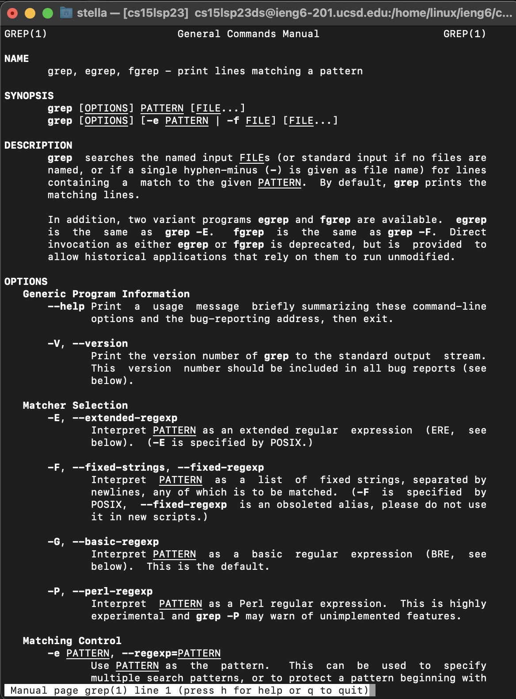
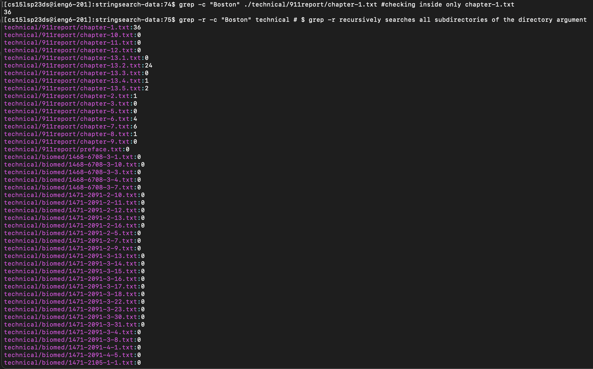
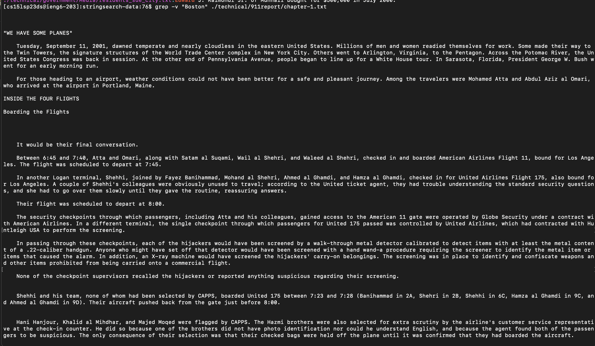
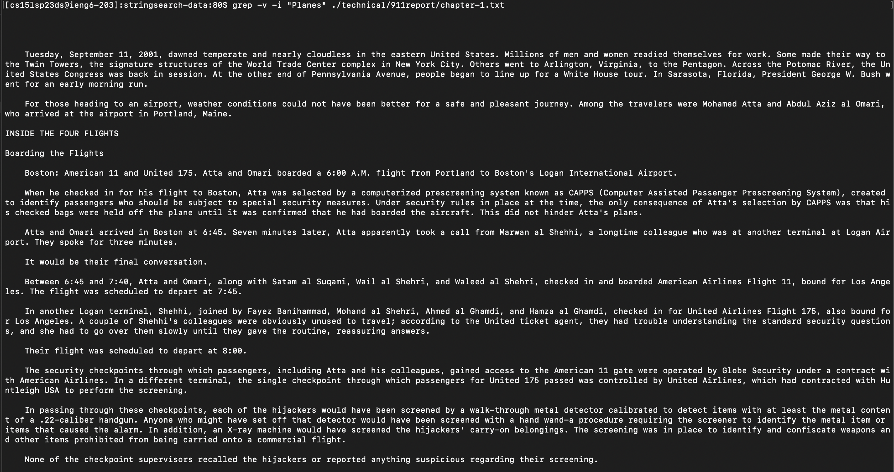
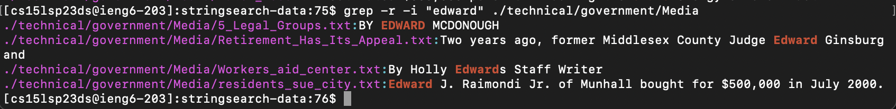

# Lab Report 3: Researching Commands
## grep command: command line options
1. ``` $ grep -c "<string>" fileName.txt ```
This command counts the number of matches in a file or set of file instead of printing the matches. 
2. ``` $ grep -w "<string>" fileName.txt```
This command narrows search to only whole words not partial matches as in the case of smaller words nested inside larger ones.
3. ``` $ grep -v "<string>" fileName.txt```
This command works opposite to the grep command in that it prints all the lines that don't match the specified pattern. 
4. ``` $ grep -i "<string>" fileName.txt```
This command ignores cases distitnctions when searching for the pattern in files. 
5. ``` $ grep -n "<string>" fileName.txt```
This command prefixes each matching line output with the line number in the file where it was found.

The above commands were found using [chatGTP](https://chat.openai.com/) by typing "grep command line options".
These were corroborating by checking the command manuel in terminal by typing ``` man grep ```. The output is shown below:


## Examples: using grep command line options of ./technical
1.  ``` grep -c "<string>" fileName.txt ```

The above output demonstrate two examples of running ``` grep -c "<string>" fileName.txt ```
- The first example: ``` $ grep -c "Boston" ./technical/911report/chapter-1.txt ``` checks the chapter-1.txt file (located in the 911reports subdirectory, in the technical directory) for the word Boston which as the output demonstrate appears 36 times. 
- The second example: ``` $ grep -r -c "Boston" ./technical ``` is an example of a commbination og command line options. The -r recursively searches through all the subdirectories with in the technical file which in this case includes 911report (add all its chapters 1-13.5 as wellas the prefeces files), biomed (and all its files), government (ad its 6 folders as well as all the contents of the files in all 6 folders), as well as plos (and all its files). Each file check is displayed, shown as the path beggining with technical and the number of times "Boston" appear in each file next to the path to each file. This call essential checks every file within technical and displays the number of times technical appears in those files. (The whole output for example #2 is not shown).
2.   ``` grep -v "<string>" fileName.txt```
-  This example: ``` $ grep -v "Boston" ./technical/911report/chapter-1.txt ``` demonstrate an output removing the word "Boston" from the file. This example is helpful in understanding the command as Boston is a proper noun and therefore will alwyas appear in the form Boston beggining with a capital B whereas other words have differing capitalization depending on where they appear in the sentence. 
- File:.png) Command Output: This example: ``` $ grep -v -i "Planes" ./technical/911report/chapter-1.txt ``` demonstrate removing the word Planes regardless of capitalization (```-i ```). 
3.   ``` grep -i "<string>" fileName.txt```
-  The first example demonstrates finding all instnaces of the word "state" regardless of case. The first occurence of "state" was found in all caps but it was still highlighted in the output as this command ignores case. The contents of the file is printed unlike with the ``` grep -c "<string>" fileName.txt ``` command.
- 
This example: ``` $ grep -r -i "edwarrd" ./technical/government/Media ``` similarly demonstrates a recurrsive call to grep ignoring the case (```-i ```). This example I limited the files to government --> media file in order to produce a smaller output. 

---
## grep command: alternative commands with similar behavior
1. ``` ack```
This command searches for files for a specified pattern but works differently to grep in that it doesn't ignore certain files by default. 
2. ```ag```
This command is designed to be faster than grep and supports serching through files with certain extensions only
3. ```sed```
This command can be used to find and replace text in a file. 
[DDBeck.com](https://ddbeck.com/better-than-grep-for-writers/)
[Software Testing Help](https://www.softwaretestinghelp.com/grep-command-in-unix/)
