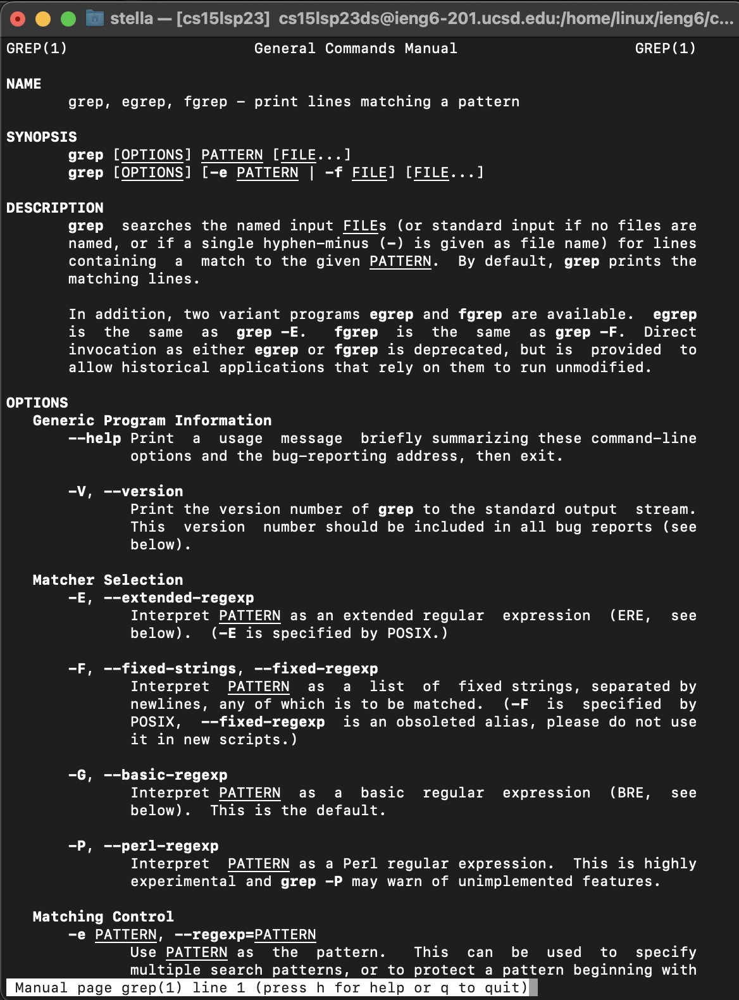

# Lab Report 3: Researching Commands
## grep command: command line options
1. ``` grep -c "<string>" fileName.txt ```
This command counts the number of matches in a file or set of file instead of printing the matches. 
2. ``` grep -w "<string>" ```
This command narrows search to only whole words not partial matches as in the case of smaller words nested inside larger ones.
3. ``` grep -v "<string>" ```
This command works opposite to the grep command in that it prints all the lines that don't match the specified pattern. 
4. ``` grep -i "<string>" ```
This command ignores cases distitnctions when searching for the pattern in files. 
5. ``` grep -n "<string>" ```
This command prefixes each matching line output with the line number in the file where it was found.

The above commands were found using [chatGTP](https://chat.openai.com/) by typing "grep command line options".
These were corroborating by checking the command manuel in terminal by typing ``` man grep ```. The output is shown below:


## Examples: using grep command line options of ./technical


---
## grep command: alternative commands with similar behavior
1. ``` ack```
This command searches for files for a specified pattern but works differently to grep in that it doesn't ignore certain files by default. 
2. ```ag```
This command is designed to be faster than grep and supports serching through files with certain extensions only
3. ```sed```
This command can be used to find and replace text in a file. 
[DDBeck.com](https://ddbeck.com/better-than-grep-for-writers/)
[Software Testing Help](https://www.softwaretestinghelp.com/grep-command-in-unix/)
